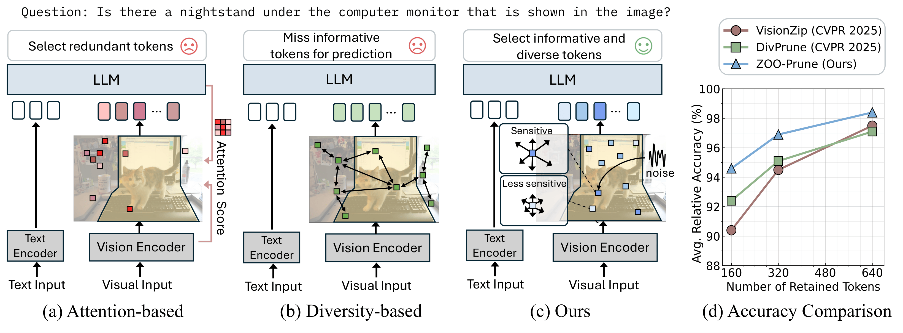

# ZOO-Prune: Training-Free Token Pruning via Zeroth-Order Gradient Estimation in Vision-Language Models (CVPR 2026)

> Authors: [Youngeun Kim<sup>1*](https://lotusroot-kim.github.io/research_homepage/), [Youjia Zhang<sup>2*](https://youjia-zhang.github.io/), [Huiling Liu<sup>2](https://scholar.google.com/citations?view_op=list_works&hl=en&user=WQfYo0MAAAAJ), [Aecheon Jung<sup>2](https://sites.google.com/view/kasurashan), [Sunwoo Lee<sup>3](https://sites.google.com/view/sunwoolee/), [Sungeun Hong<sup>2</sup>](https://www.csehong.com/) <br>
> <sup>1</sup>Amazon, <sup>2</sup>Sungkyunkwan University, <sup>3</sup>Inha University

<a href="https://aim-skku.github.io/ZOO-Prune/"></a> &ensp; <a href="https://openaccess.thecvf.com/content/CVPR2026/html/Kim_ZOO-Prune_Training-Free_Token_Pruning_via_Zeroth-Order_Gradient_Estimation_in_Vision-Language_CVPR_2026_paper.html"></a> &ensp;


<p align=center></p>


## Abstract
> Large Vision-Language Models (VLMs) enable strong multimodal reasoning but incur heavy inference costs from redundant visual tokens. Token pruning alleviates this issue, yet existing approaches face limitations. Attention-based methods rely on raw attention scores, which are often unstable across layers and heads and can lead to redundant selections. Diversity-based methods improve robustness by selecting tokens far apart in feature space, but risk dropping regions needed for accurate prediction. We propose ZOO-Prune, a training-free framework built on the intuition that highly sensitive tokens have a stronger influence on the model's output and capture complementary visual cues rather than redundant ones. To achieve this, we estimate token sensitivity using zeroth-order perturbations at the lightweight projection layer. This measures how small random perturbations affect the projected features and enables efficient approximation of each token's influence without backpropagation. Extensive experiments across multiple VLMs and benchmarks show that ZOO-Prune consistently outperforms prior methods while pruning up to 94.4% of tokens without sacrificing accuracy. Our method also improves efficiency, reaching up to 2.30x faster end-to-end inference compared to the baseline.

## Installation

1. **Clone this repo**

    ```bash
    git clone https://github.com/AIM-SKKU/ZOO-Prune.git
    ```

2. **Setting the environment**
    ```sh
    conda create -n zoo_prune python=3.10 -y
    conda activate zoo_prune
    conda install pytorch==2.1.2 torchvision==0.16.2 torchaudio==2.1.2 pytorch-cuda=11.8 -c pytorch -c nvidia
    pip install -r requirements.txt
    cd LLaVA
    pip install -e .
    cd ..
    ```

## Evaluation 
The evaluation code follows the structure of [lmms-eval](https://github.com/EvolvingLMMs-Lab/lmms-eval).

**Quick Start**

To run the default evaluation, use:

```bash
bash ./run_zoo_prune.sh
```
 
This script provides a simple entry point for evaluating the model with a predefined benchmark, pretrained model, and pruning ratio.

## Citation

If you find this work useful, please consider citing it.

```
@InProceedings{Kim_2026_CVPR,
    author    = {Kim, Youngeun and Zhang, Youjia and Liu, Huiling and Jung, Aecheon and Lee, Sunwoo and Hong, Sungeun},
    title     = {ZOO-Prune: Training-Free Token Pruning via Zeroth-Order Gradient Estimation in Vision-Language Models},
    booktitle = {Proceedings of the IEEE/CVF Conference on Computer Vision and Pattern Recognition (CVPR)},
    month     = {June},
    year      = {2026},
    pages     = {39572-39582}
}
```

# Acknowledgements
The code is implemented based on [lmms-eval](https://github.com/EvolvingLMMs-Lab/lmms-eval), [LLaVA](https://github.com/haotian-liu/LLaVA) and [DivPrune](https://github.com/vbdi/divprune). 
We thank the contributors for their great work!
